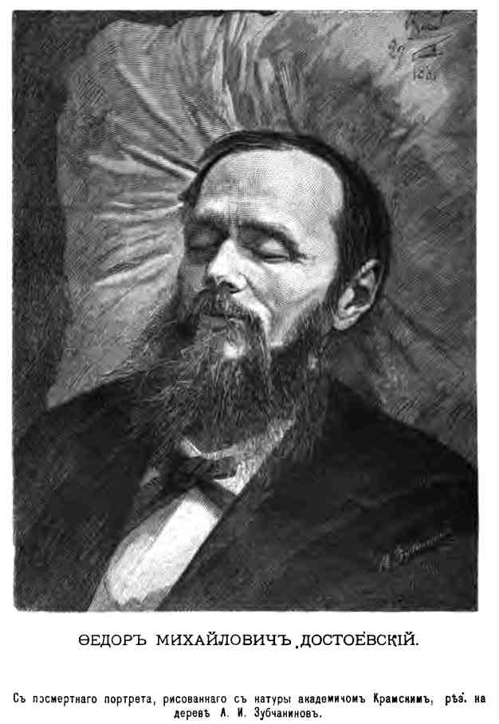

В этом проекте я буду использовать собственноручно созданный мини-корпус малой прозы Достоевского, состоящий из следующих произведений:

- Честный вор (1848)
- Ёлка и свадьба (1848)
- Маленький герой (1849)
- Чужая жена и муж под кроватью (1860)
- Скверный анекдот (1862)
- Крокодил (1865)
- Бобок (1873)
- Мужик Марей (1876)
- Мальчик у Христа на ёлке (1876)
- Сон смешного человека (1877)

Сами тексты взяты из Полного собрания сочинений Ф. М. Достоевского в 30-ти томах:

- [Том 2. Повести и рассказы, 1848-1859](https://russian-literature.org/tom/409216)
- [Том 5. Повести и рассказы. 1862-1866](https://russian-literature.org/tom/409686)
- [Том 21. Дневник писателя, 1873; Статьи и заметки, 1873-1878](https://russian-literature.org/tom/416405)
- [Том 22. Дневник писателя за 1876 год. Январь-апрель](https://russian-literature.org/tom/416464)
- [Том 25. Дневник писателя за 1877 год. Январь-август](https://russian-literature.org/tom/416515)

